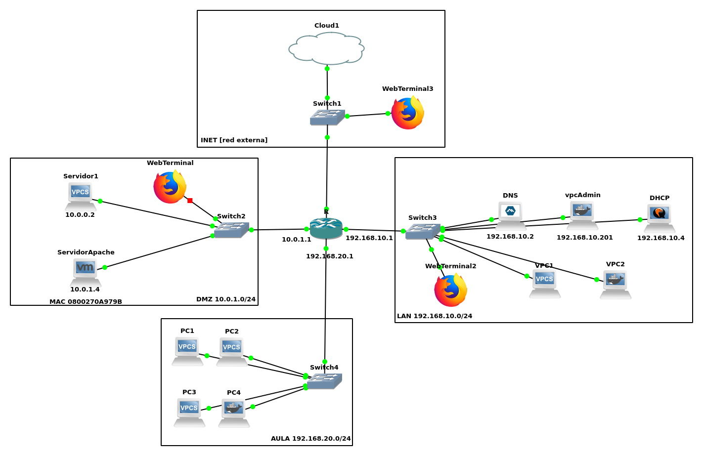

# Proyecto Apache
## Entorno
Trabajaremos en una máquina ubuntu server con IP estática.
La configuración del mikrotik de ejemplo puedes consultarla [aquí](./mikrotik/conf_mikrotik.md).




## Explicación de los usuarios y permisos.
Si necesitas aclaración echale un vistazo a ["esto"](./usuariosypermisos.md).

## Introducción a los servidores WEB
* Paso 1. Crear una página WEB que simule una empresa con 2 imagenes que estarán en el directo /var/www/intro/img/ la página se llamará  /var/www/intro/senia.html (más adelante accederemos con www.seniatic.com)
* Paso 2. Copia el archivo de configuración base 000-default.conf y llamarlo senia.conf
* Paso 3. Habilitar vuestro sitio WEB y deshabilitar el sitio por defecto. Utiliza para ello los comandos `a2ensite` y `a2dissite`.
* Paso 4. Reiniciar y probar. http://ip/senia.html
* Paso 5. Estudia la directiva DirectoryIndex y modifica tu configuración para poder acceder sin indicar la página. Probar con http://ip/
* Paso 6. Describe que ves en los archivos `/var/log/apache2/error.log` y  `/var/log/apache2/access.log` 

## Virtual hosting en Apache 2.4
Crear dos nuevos sitio web, el primero, www.blogseniaTIC.com y el segungo www.intranetseniatic.com. Además de estos ya creamos en /var/www/html el sitio WEB que ahora se corresponderá con www.seniaTIC.com
* Paso 1. Modificar el sitio de senia.conf para que atienda al nombre www.seniaTIC.com
* Paso 2. Probar `curl www.seniaTIC.com` 
* Paso 3. Crear un nuevo directorio en /var/www/blogseniaTIC
* Paso 4. Seguir los pasos para crear el sitio WEB www.blogseniaTIC.com configurándolo para acceder por nombre
* Paso 5. Probar `curl www.blogseniaTIC.com`
* Paso 6. Crear un nuevo directorio en /var/www/intranetseniaTIC
* Paso 7. Seguir los pasos para crear el sitio WEB www.intranetseniaTIC.com configurándolo para acceder por nombre pero en el puerto 8080
* Paso 8. Probar `curl www.intranetseniaTIC.com:8080`

## Mapeo de URL
* Paso 1. Crear el direcotrio /var/www/blogseniaTIC/docs y añadirle un par de archivos.
* Paso 2. Configurar el sitio web para que cuando se acceda http://www.blogseniaTIC.com/docs se liste los archivos del directorio
* Paso 3. Añadir una redirección temporal a la página oficial del IES donde simularemos que se ha movido temporalmente un recurso oficial. Se accedera con www.seniaTIC.com/oficial y el servidor devloverá una respuesta con codigo 302
* Paso 4. Crear una página de error 404 personalizada para el sitio www.seniaTIC.com
  

## Control de acceso, autentificación y autorización
* Paso 1. Crear un directorio admin en `/var/www/intro/admin` y añadir un par de archivos
* Paso 2. Configuramos el servidor para que solo el usuario mortadelo y filemon puedan acceder a estos recursos. Utilizar **seguridad Basic**. Probar **desde el navegador** con http://www.seniaTIC.com/admin o con http://IP_serverApache/admin
* Paso 3. Vamos a crear un directorio llamado `/var/www/intro/root` que solo pueda acceder el usuario admin_root con la ip del equipo anfitrión(donde utilizamos el navegador). Utilizando **seguridad Digest** y la configuración realizada en un fichero .htaccess. Probar **desde el navegador** con  http://www.seniaTIC.com/root o con http://IP_serverApache/root/

## Módulos en Apache
**Configura apache para mostrar aplicaciones con el lenguaje php**. 
* Paso 1. Instala la última versión (2023-->8.1)
* Paso 2. Copia el siguiente script ["operacion.php"](./operacion.php) en la raíz del sito www.seniaTIC.com
* Paso 3. Prueba el funcionamiento. "http://www.seniaTIC.com/operacion.php?op=suma&op1=23&op2=6"

**Configura el modulo de directorio de usuarios**
* Paso 4. Añade dos usuarios al servidor
    1. pixie/pixie
    2. dixie/dixie
* Paso 5. Configura el servidor apache2 con el modulo user_dir
* Paso 6. Validado con los usuarios pixie y dixie crea en sus home el directorio utilizado por defecto public_html y dentro crea una página WEB
* Paso 7. Configura los permisos adecuados de  `home/pixie` y `home/dixie` para que se accesibles. Añadimos a otros los permisos de ejecución para poder acceder al directorio del usuario y de lectura para que el navegado pueda ver las páginas.
```sh
sudo chmod 755 /home/pixie
```
```sh
sudo chmod 755 /home/dixie
```

* Paso 8. Prueba el funcionamiento
    1. http://www.seniaTIC.com/~pixie
    2. http://www.seniaTIC.com/~dixie

## HTTPS
* Paso 1. Creación de un **certificado autofirmado**
* Paso 2. Configuración de un nuevo VirtualHost (senia_ssl.conf) con SSL/TSL. (utilizar el sitio por defecto como plantilla)
* Paso 3. Habilitar el módulo SSL en Apache.
* Paso 4. Probar https://www.seniatic.com
* Paso 5. Configuramos el virtual host de HTTP para que redirija todo el tráfico a HTTPS de http://www.seniaTIC.com a https://www.seniaTIC.com
* Paso 6. Habilitar el modo de reescritura
* Paso 7. Probar http://www.seniatic.com

## Acoplar el servidor Apache al proyecto GNS3
* Paso 1. Configurar la interfaz de red con DHCP de la MV para que reciba por DCHP la IP estática correspondiente.
* Paso 2. Añadir la máquina virtual al proyecto GNS3 del curso en la DMZ
* Paso 3. Probar con un WEBTerminal en la DMZ que funciona correctamente. (También podrías probarlo con curl)
* Paso 4. Configurar el DNS server de la LAN para resolver los nombres de la zona seniaTIC.com. Solo es necesario los de esta zona. Como ampliación puedes crear nuevas zonas para reslover el resto. Si no lo haces puedes añadirlos en el /etc/hosts de los clientes(VPCs)
* Paso 5. Modificar mikrotik para permitir el acceso desde la LAN al servidor WEB de la DMZ y desde Internet al servidor WEB de la DMZ
* Paso 6. Probar el funcionamiento situando WebTerminales en la red INET y la red LAN y accediendo al servidor.


Una vez Visto nos pasaremos al proyecto [NGINX](nginx/readme.md)