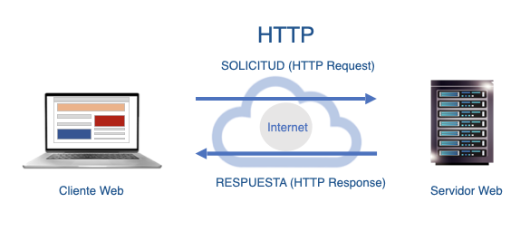
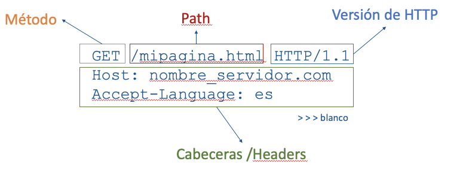
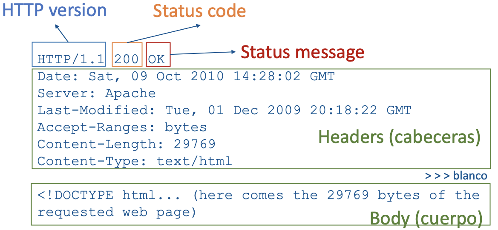
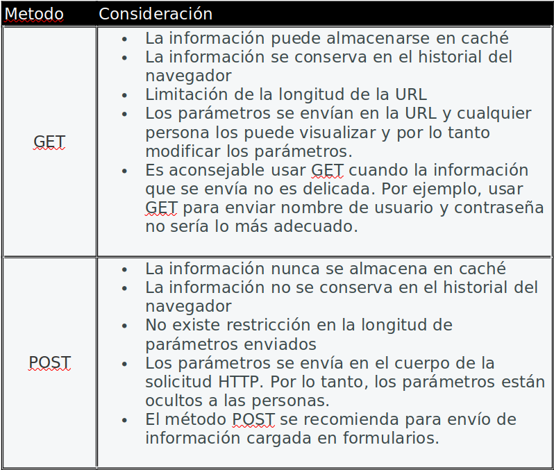
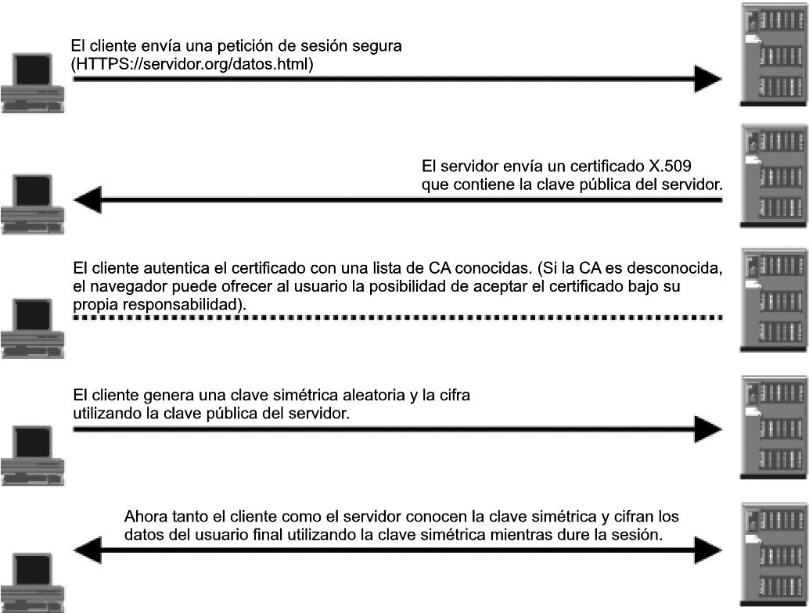

# Servicio WEB 

## El servicio WEB

A diferencia del Modelo Cliente-Servidor genérico, en la Web:
* **El CLIENTE** es un Navegador Web (o browser , en inglés) que puede ser ejecutado desde un dispositivo (p. ej., portátil, teléfono móvil, tableta).. Ejemplo de Navegador Web son Google Chrome, Internet Explorer, Edge, Safari, Opera, entre otros. 
* **El SERVIDOR** es una aplicación software (denominado "servidor Web") que se ejecuta en un computador, generalmente localizado en la nube, y que escucha las peticiones del cliente por un puerto de comunicaciones (generalmente el puerto 80). Ejemplo de estas aplicaciones software son Apache, Apache Tomcat, Internet Information Services (IIS), Glassfish, entre otros.
* La comunicación entre Cliente y Servidor se realiza a través del Protocolo de Transferencia de Hipertexto (**HTTP**); el cual hace uso por detrás del protocolo TCP/IP.


## El protocolo HTTP 

**HTTP** es un conjunto de formatos y normas que es utilizado en la Web para transferir el Hypertexto entre Cliente y Servidor.

## Puertos involucrados en el servicio
En el protocolo HTTP el puerto por defecto es el 80 y en el protocólo HTTPS el puerto por defecto es el 443.

## Conceptos sobre el protocolo HTTP
HTTP tiene dos características importantes y son que HTTP es un protocolo SIN ESTADO y ORIENTADO A LA CONEXIÓN.
### Protocolo sin estado
Sin estado significa que el concepto de sesión no existe. Es decir, tras una conexión cliente-servidor, el servidor no mantiene registro del cliente que se conectó. De esta manera, cada vez que el mismo cliente se conecte al servidor, el servidor lo tratará como un cliente nuevo porque el servidor no establece relaciones entre las conexiones.
### Protocolo orientado a la conexión
Orientado a la conexión significa que HTTP utiliza por debajo el protocolo TCP/IP para establecer la comunicación entre cliente y servidor; algo propio del modelo Cliente-Servidor. Decir que HTTP es orientado a la conexión es decir que HTTP se vale de TCP/IP para realizar la comunicación.

## ¿Cómo sucede la comunicación a través de HTTP?

Video explicativo. https://youtu.be/wHXRmq75N_Y

La comunicación a través de HTTP se fundamenta en el envío y recepción de mensajes. Estos mensajes pueden ser de SOLICITUD (HTTP Request) o de RESPUESTA (HTTP Response). Los mensajes HTTP siguen la siguiente estructura (como se muestra en la figura):
1. Una línea de Inicio
1. Ninguno o varios campos de cabeceras
1. Una línea vacía (espacio en blanco)
1. Opcionalmente, el cuerpo el mensaje

El contenido del mensaje según sea la petición o la respuesta lo podemos ver en el siguiente esquema:


### HTTP Request



**Línea de inicio** Esta línea está conformada por:
* El método:  En nuestro ejemplo, la palabra GET es un método/comando de HTTP que significa “Obtener”
* Path (o ruta): camino o path del recurso (hipertexto) que se desea "obtener". En el ejemplo, “/mipagina.html”
* Versión del protocolo: especifica la versión del protocolo HTTP utilizado. En el ejemplo: versión 1.1 de HTTP


**Cabecera** Una cabecera es información adicional acerca de la conexión que es enviada al servidor
(** más sobre cabeceras,al final)
* La cabecera Host (línea 2) indica el nombre del servidor hacia donde se envía la petición,
* La cabecera Accept-Language (línea 3) indica el idioma aceptado por el Cliente, en este caso español.

### HTTP Response

**Línea de inicio** 
Esta parte (línea 1) está conformada por:
* Versión del protocolo HTTP.- Es la versión del protocolo HTTP en la que se envía la respuesta. En el ejemplo se usa la versión 1.1 de HTTP (HTTP/ 1.1).
* Código de estado.- Indica si la petición ha sido exitosa, o no, y debido a que. Estos códigos están especificados por el RFC 2616. El primer dígito del código de estado especifica uno de los 5 tipos de respuesta, el mínimo para que un cliente pueda trabajar con HTTP es que reconozca estas 5 clases:
        
        | id | Descripción |
        |----------|----------|
        | 1XX | Respuestas informativas |
        | 2XX | Peticiones correctas |
        | 3XX | Redirecciones |
        | 4XX | Errores del cliente |
        | 5XX | Errores de servidor |


**Cabecera** 
* Para enviar información sobre el software que ejecuta el servidor se usa la cabecera
``` Server: Apache/2.4.1 (Unix) ```
* Para indicar la fecha de la última modificación del recurso solicitado
```Last-Modified: Wed, 21 Oct 2015 07:28:00 GMT``` 
* Para indicar el tipo de medio (MIME) del recurso
  ```Content-Type: text/html; charset=utf-```

**Cuerpo**``
El cuerpo del mensaje contiene, opcionalmente, el contenido del recurso que se ha solicitado en la petición HTTP. En nuestro caso, este recurso es la página ”mipaginal.html” que está escrita en código HTML y que fue solicitada en la solicitud HTTP (ver la sección anterior).

## Métodos


### Método GET
El método HTTP GET solicita un recurso específico al Servidor. 
Ejemplo:
```
GET /index.html
```
En este ejemplo, el Cliente solicita la página index.html.

### Método POST
El método HTTP POST envía datos al servidor. Ejemplo:
```
POST / HTTP/1.1
Host: foo.com
Content-Type: application/x-www-form-urlencoded Content-Length: 13 
say=Hi&to=Mom
```
El usuario tiene un formulario y cuando pulsa el botón enviar, se envía una solicitud HTTP que utiliza el método POST para enviar el contenido del formulario como lo muestra la última línea "say=Hi&to=Mom". Nota que el valor de la cabecera "Content-Type" establece que la información enviada es del tipo "form", que corresponde a información de un formulario.

### Comparativa entre GET y POST



## Ampliación
### Cabeceras
* Documentación de Mozilla:
[https://developer.mozilla.org/es/docs/Web/HTTP/Headers](https://developer.mozilla.org/es/docs/Web/HTTP/Headers)
* Lista de Cabeceras (Wikipedia)
[https://en.wikipedia.org/wiki/List_of_HTTP_header_fields](https://en.wikipedia.org/wiki/List_of_HTTP_header_fields)

### Métodos HTTP
* [https://developer.mozilla.org/es/docs/Web/HTTP/Methods](https://developer.mozilla.org/es/docs/Web/HTTP/Methods)

### Códigos de estado de HTTP Response
* [https://developer.mozilla.org/es/docs/Web/HTTP/Status](https://developer.mozilla.org/es/docs/Web/HTTP/Status)

## Otras características

* **Cookies**: Las cookies son información que el navegador guarda en memoria o en el disco duro dentro de ficheros de texto, a solicitud del servidor.
* **Sesiones**: HTTP es un protocolo sin manejo de estados. Las sesiones nos permiten definir estados, para ello el servidor almacenará la información necesaria para llevar el seguimiento de la sesión.
* **Autentificación**: A veces, debido a cuestiones de personalización o a políticas de restricción, las aplicaciones Web deben conocer y verificar la identidad del usuario, mediante nombre de usuario y contraseña.
* **Conexiones persistentes**: Permiten que varias peticiones y respuestas sean transferidas usando la misma conexión TCP.

  
## SSL

**SSL** es un protocolo que proporciona privacidad e integridad entre dos aplicaciones de comunicaciones utilizando HTTP. El Protocolo de transferencia de hipertexto (HTTP) para World Wide Web utiliza SSL para que las comunicaciones sean seguras. Una visión general simplificada de cómo se procesa el protocolo de enlace SSL es la siguiente: 



SSL es un protocolo de comunicación que proporciona principalmente tres servicios básicos de seguridad: confidencialidad, autenticación e integridad. Con el fin de garantizar dichos servicios, SSL hace uso tanto de la criptografía asimétrica (basada en la existencia de un par de claves, la pública y la privada) como de la criptografía simétrica (basada en la utilización de una única clave secreta). La justificación de dicha combinación viene dada por cuestiones de eficiencia, puesto que las transformaciones criptográficas (operaciones de cifrado y descifrado) realizadas mediante técnicas de criptografía asimétrica son del orden de diez mil veces más lentas que las realizadas con criptografía simétrica. SSL negocia en una primera fase utilizando criptografía asimétrica (p.e. RSA), y cifra posteriormente la comunicación utilizando criptografía simétrica (RC4, RC5, IDEA...)
